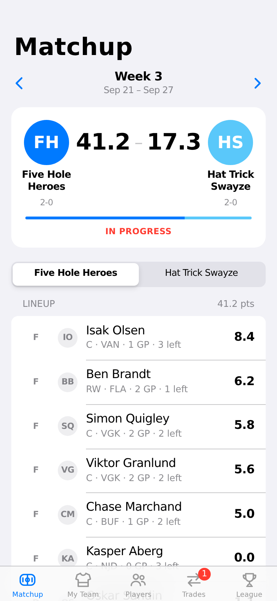
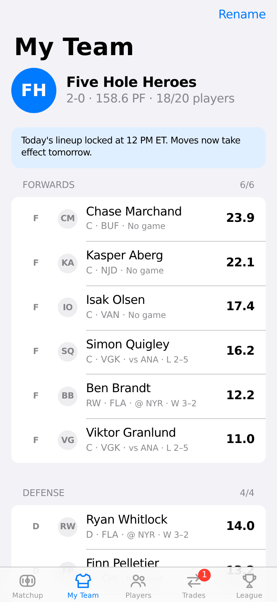
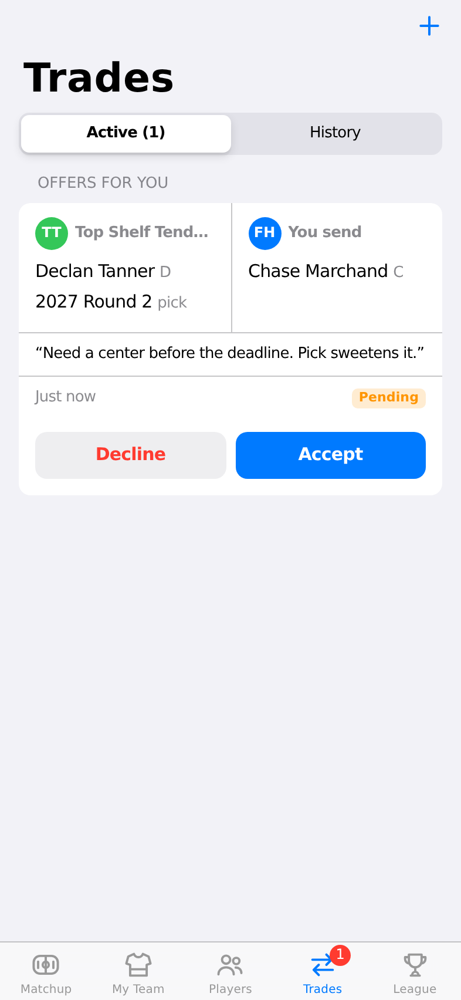
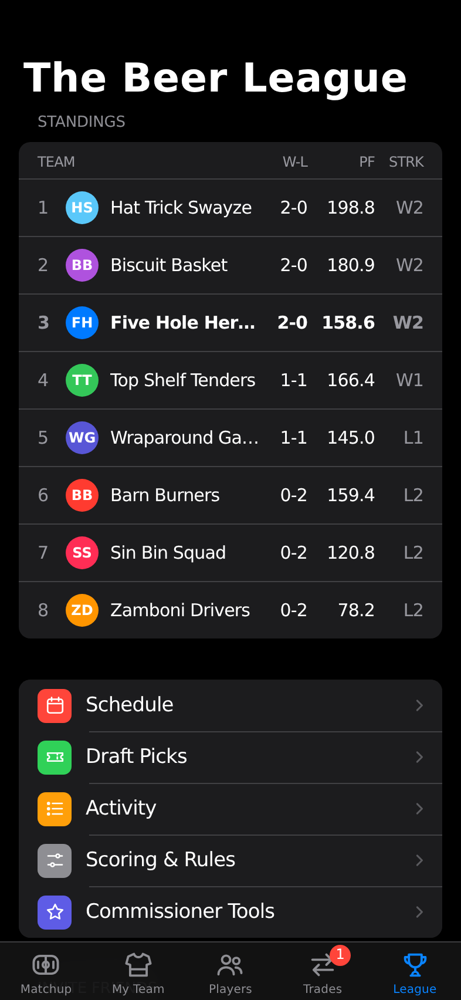

# Fantasy Hockey

A private fantasy hockey app for our league, built to look and feel like
a stock iPhone app: no ads, live NHL stats, head-to-head matchups, and
trades that can include future draft picks.

**New here? Start with [SETUP.md](SETUP.md).** It walks through getting the
app online and onto everyone's phones, with no coding required.

<p>
  
  
  
  
</p>

## Features

- **Matchup:** live head-to-head scoreboard, player-by-player points, games left this week, and the rest of the league's scores.
- **My Team:** lineup slots (F / D / UTIL / G / Bench) with tap-to-move, today's NHL games, and your draft picks.
- **Players:** search every NHL player, filter free agents by position, and see the player card with season stats and the last 14 days.
- **Trades:** offer any mix of players and future draft picks. The other owner accepts or declines, and trades fail safely if anything changed hands in the meantime.
- **League:** standings, schedule, draft pick ownership, activity feed, scoring rules, and commissioner tools.
- Follows the phone's light and dark mode, installs to the Home Screen, and works on Android too.

## How it's built

| Part | Where | Notes |
|---|---|---|
| App (screens) | `src/` | React + TypeScript, styled with iOS system colors and typography (`src/styles/ios.css`). |
| League rules | `supabase/migrations/0001_init.sql` | Postgres tables plus functions for every action (add/drop, lineup, trades, commissioner tools). Row-level security keeps each league private. |
| NHL stats | `api/`, `shared/nhl.ts` | Vercel server functions that read the NHL's public stats service ([endpoint reference](https://github.com/Zmalski/NHL-API-Reference)) and cache the results. |
| Scoring | `shared/scoring.ts` | Shared by the app (live scores) and the nightly job (`api/cron/finalize.ts`) that locks in final weekly results. |
| Demo mode | `src/data/demo/` | With no Supabase keys, the real schema runs in the browser (PGlite) with a fictional league. |

Roster history is stored as dated stints, so scoring for any past day
reflects exactly who was in each lineup, even after trades and drops.

## Developing

```bash
npm install
npm run dev        # http://localhost:5173 (demo mode unless .env.local has Supabase keys)
npm test           # database rules, scoring, schedule and demo tests
npm run build      # typecheck + production build
```

Copy `.env.example` to `.env.local` to point the app at a Supabase project.
The `/api` stats functions run on Vercel. Locally, use `npx vercel dev` to run them.

## Not built yet

- A live draft room (picks can be traded, and rosters are loaded by the commissioner)
- Fantasy playoffs
- Push notifications for trade offers
- An injured-reserve (IR) slot
